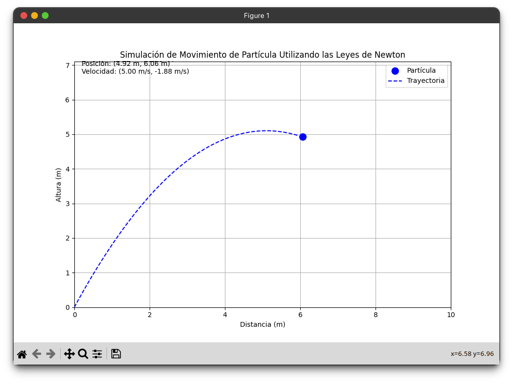

# Proyecto de física General

## Explicación:

Este código simula el movimiento de una partícula bajo la influencia de la gravedad. Aquí tienes una explicación detallada del código:

**Función `calculate_interaction_force`**:

- Esta función calcula la fuerza de interacción en la partícula en función del tiempo `t`, las variables de estado `y` (que representan la posición y velocidad en los ejes x e y), y la masa de la partícula `m`.

- La única fuerza considerada es la fuerza gravitatoria en el eje y, que es proporcional a la masa de la partícula y a la aceleración debida a la gravedad.
1. **Condiciones iniciales**:
    - Se definen las condiciones iniciales de la partícula, que son la posición inicial `[0.0, 0.0]` y la velocidad inicial `[5.0, 10.0]` en los ejes x e y.
2. **Masa de la partícula**:
    - La masa de la partícula se establece en `1.0`.
3. **Intervalo de tiempo y puntos de tiempo**:
    - Se define un intervalo de tiempo de simulación de `(0, 2)` segundos.
    - Se especifica el número de frames (`num_frames`) y se genera un conjunto de puntos de tiempo uniformemente distribuidos entre el intervalo de tiempo.
4. **Resolución de ecuaciones diferenciales**:
    - Se utiliza la función `solve_ivp` del módulo `scipy.integrate` para resolver las ecuaciones diferenciales del movimiento de la partícula.
5. **Configuración de la gráfica**:
    - Se configuran las propiedades de la gráfica, como el título, etiquetas de ejes y límites.
6. **Inicialización de la partícula en la gráfica**:
    - Se crea un objeto de partícula (`particle`) y una trayectoria (`trajectory`) en la gráfica.
7. **Actualización en tiempo real**:
    - La función `update` se llama en cada frame de la animación y actualiza la posición de la partícula y la trayectoria en la gráfica, así como la información en tiempo real.
8. **Animación de la gráfica**:
    - Se utiliza `FuncAnimation` para animar la gráfica mediante la llamada a la función `update` en cada frame.
9. **Mostrar la gráfica**:
    - Finalmente, se muestra la gráfica animada.

## Ecuaciones usadas:

Las ecuaciones que rigen el movimiento de la partícula son las ecuaciones diferenciales que describen la cinemática y la dinámica del sistema. En este caso, para una partícula bajo la influencia de la gravedad, las ecuaciones son las siguientes:

1. **Ecuaciones de Cinemática**:
    
    $$
     \frac{dx}{dt} = v_x \text{ , } 
     \frac{dy}{dt} = v_y 
    $$
    
    Estas ecuaciones describen cómo la posición $(x, y)$ de la partícula cambia en función del tiempo $t$, donde $v_x$ y $v_y$  son las componentes de la velocidad en los ejes $x$ e $y$, respectivamente.
    
2. **Ecuaciones de Dinámica**:
    
    $\frac{dv_x}{dt} = \frac{F_x}{m} \text{ , }
    \frac{dv_y}{dt} = \frac{F_y}{m}$ 
    
    Estas ecuaciones describen cómo la velocidad de la partícula cambia en función del tiempo. $F_x$ y $F_y$ son las componentes de la fuerza aplicada en los ejes $x$ e $y$, respectivamente, y $m$ es la masa de la partícula.
    

En este caso, la única fuerza considerada es la fuerza gravitatoria en el eje $y$:

$F_y = -mg$

### Donde:

- $m$ es la masa de la partícula.
- $g$ es la aceleración debida a la gravedad.

Entonces, las ecuaciones de movimiento completas son:

$$
\frac{dx}{dt} = v_x
\frac{dy}{dt} = v_y
\frac{dv_x}{dt} = 0  \text{ (ya que no hay fuerzas en el eje x) }
\frac{dv_y}{dt} = -\frac{g}{m}
$$

Estas ecuaciones diferenciales son resueltas numéricamente mediante la función `solve_ivp` para obtener las posiciones y velocidades de la partícula en función del tiempo.